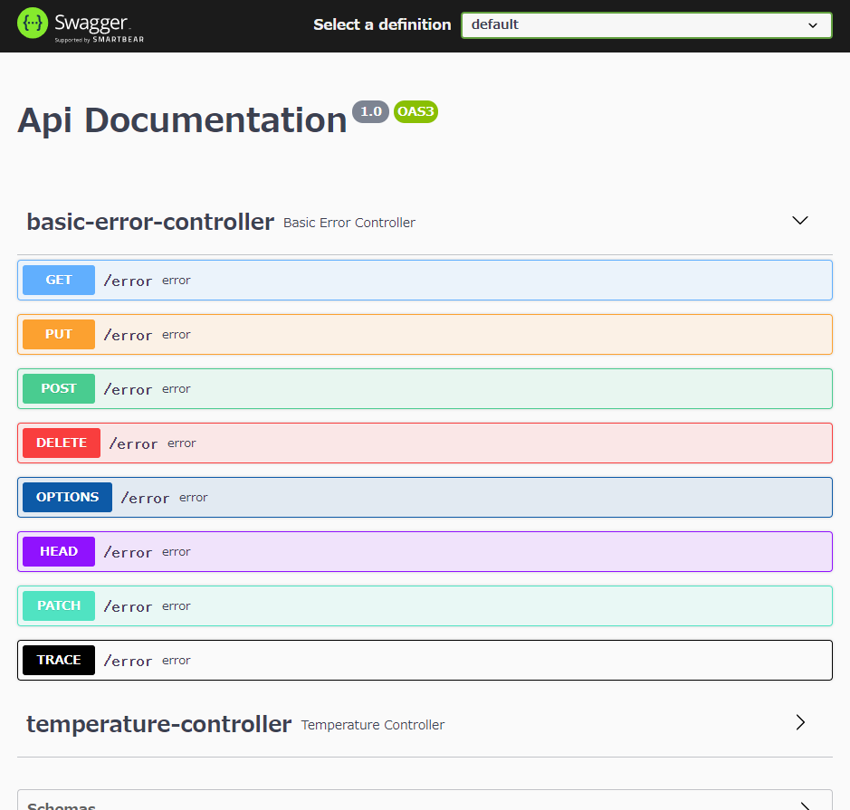
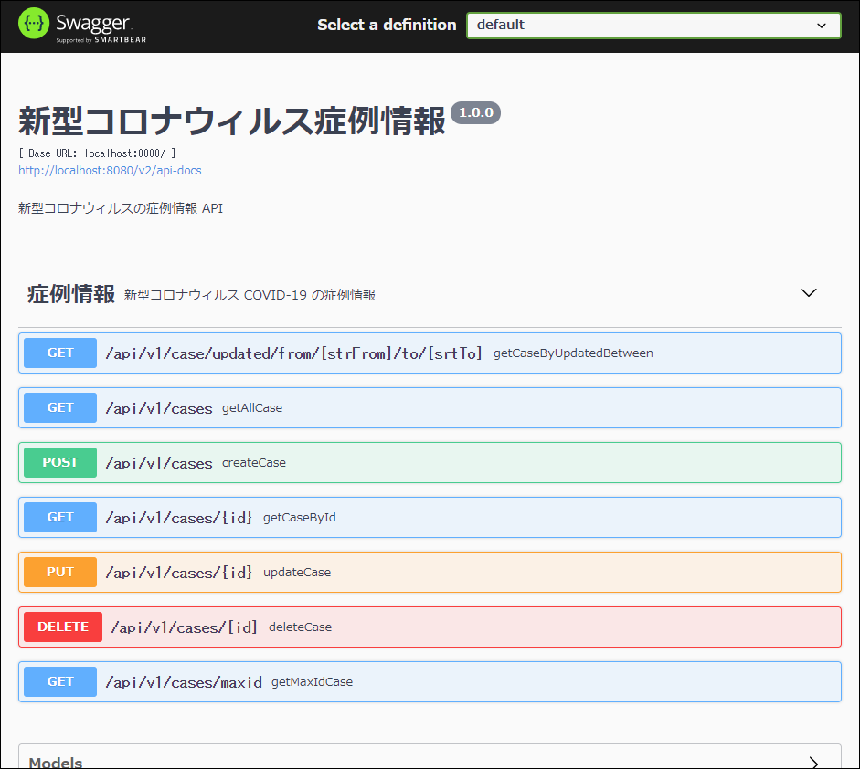

# Spring Boot に Swagger を導入する方法
Spring Fox を追加するだけで良い。ただし、そのままでは不要な記載も表示されてしまうので、Swagger の設定を行う。

## Spring Fox を追加する
Spring Boot アプリに Swagger（Open API）を表示させるには、依存関係に Spring Fox を追加するだけで良い。

build.gradle の dependencies に Spring Fox を追加する。
```groovy
dependencies {
	implementation 'io.springfox:springfox-boot-starter:3.0.0'
}
```

## basic-error-controller を消したい
初期状態では Swagger-UI に不要な basic-error-controller の情報まで表示されてしまっている。 


不要な情報を表示させないようにするためには、`SwaggerConfig.java` ファイルを作成する。

/src/main/java/com/github/furistao/covid19/SwaggerConfig.java:
```java
@Configuration
@EnableSwagger2
public class SwaggerConfig {

    // DocketはSpring Foxが提供するAPI。Swaggerで書き起こすために設定が必要
    @Bean
    public Docket api() {
        return new Docket(DocumentationType.SWAGGER_2).select() // ApiSelector : Swaggerで書き起こすAPIを選択する。
                .apis(RequestHandlerSelectors.basePackage("com.github.furistao.covid19"))
                // .paths(PathSelectors.ant("/pets/**")) 指定パスに一致したものだけ表示
                .paths(PathSelectors.any()).build() // ApiSelectorを作成
                .useDefaultResponseMessages(false) // 定義していないステータスコードを自動で付与
                .apiInfo(apiInfo()) // APIのインフォメーションを設定
                .tags(new Tag("症例情報", "新型コロナウィルス COVID-19 の症例情報"));
    }

    private ApiInfo apiInfo() {
        return new ApiInfoBuilder()
                .title("新型コロナウィルス症例情報")
                .description("新型コロナウィルスの症例情報 API")
                .version("1.0.0")
                .build();
    }
}
```

Tag 情報を紐づけるために、Controller 側には @Api アノテーションで tags 情報を付与しておく。

例: Covid19CaseController.java
```java
@CrossOrigin(origins = "http://localhost:3000")
@RestController
@RequestMapping("/api/v1/")
@Api(tags = "症例情報")
public class Covid19CaseController {
	@Autowired
	private Covid19CaseRepository caseRepository;
}
```

http://localhost:8080/swagger-ui/index.html


